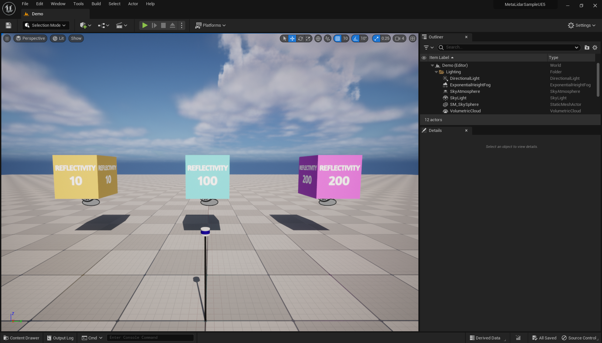
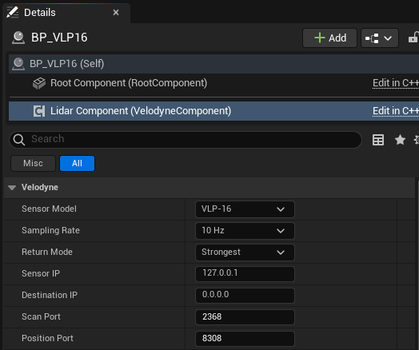

# MetaLidarSampleUE5
Sample project for testing 'MetaLidar' plugin.


## Prerequisite
This sample project is tesed under following condition:
- Ubutnu 22.04
- Intel i9-12900K
- NVIDIA RTX 3070
- RAM 32GB
- Unreal Engine 5.1.x

> **Important Note**: Currently, this project is not able to run under loopback conditions, you need another PC or SBC for receiving sensor packets or visualizing point clouds.

## Installation
First, you should install Unreal Engine 5. You can download pre-compiled UE5 for linux [here](https://www.unrealengine.com/en-US/linux). Set environment variable for UE5 root directory.
```
export UE5_ROOT=</path/to/ue5/root>
```
Clone this repo.
```
git clone https://github.com/metabotics-ai/MetaLidarSampleUE5.git
```
You should download *'MetaLidar'* and *'UDP-Uneal'* plugin for this sample project. You can simply import these plugin using *'metalidar.repos'* file via [vcstool](https://pypi.org/project/vcstool/) as below:
```
vcs import < metalidar.repos
```


You can now start the project by running the following command.
```
./update_project_files.sh
./make_editor.sh
./run_editor.sh
```
> Note: *'cleanup.sh'* is a convenient script for deleting project files.
> ```
> ./cleanup.sh
> ```

## Quick Start
We provide the 'Demo' level for a quick start, and when you start the project, you will see the following scene.



The 'Demo' level includes following components.
- Velodyne VLP-16 3D LiDAR
- Cube boxes with reflectivity 10, 100, 200

You can change sensor settings in the Lidar component.



The ***'Sensor IP'*** and ***'Destination IP'*** is the only thing you must change to see the plugin work.
- Sensor IP : The default IP address for Velodyne LiDAR sensors is '192.168.1.201'. If you want to visualize the sensor packets in legacy software like 'VeloView', you should set the 'Sensor IP' value to '192.168.1.201'.
- Destination IP : The IP address of the host PC or other device which receives packets from the LiDAR sensor.

The following image is an example configuration:


Let's press the 'Play' button for starting LiDAR sensor simulation!